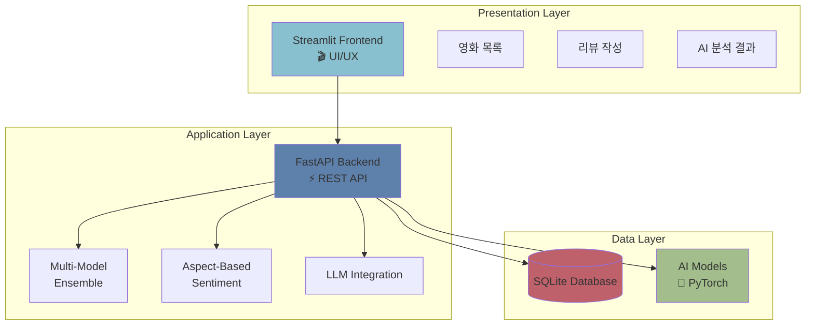
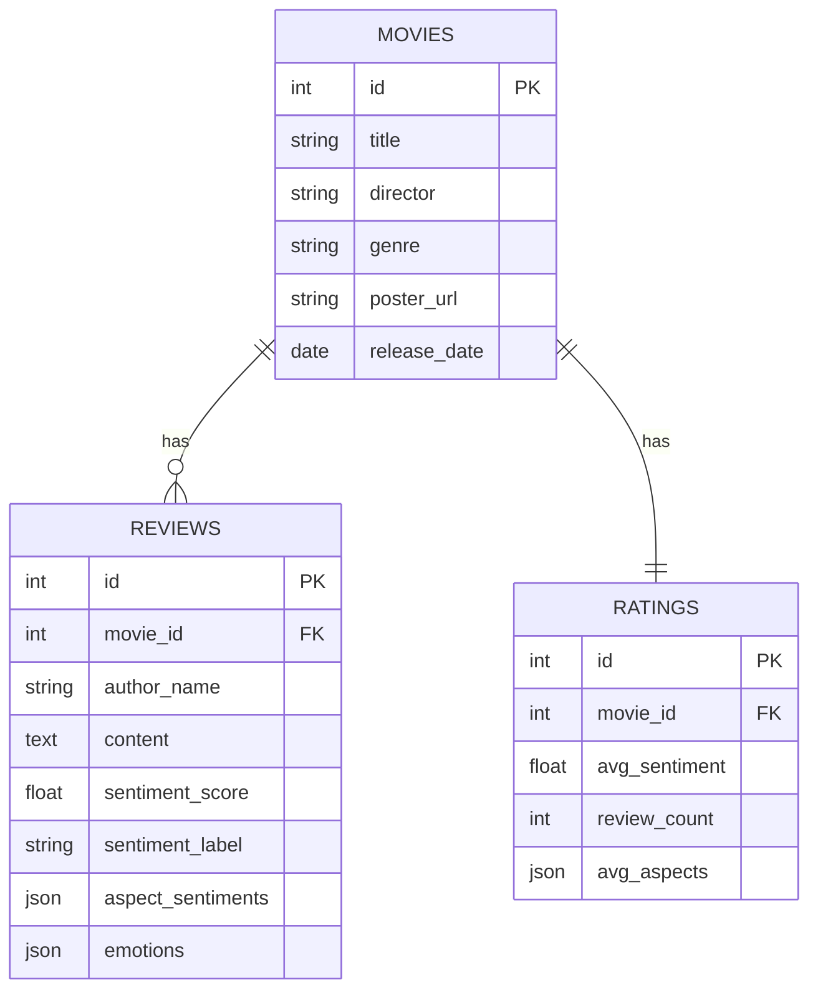
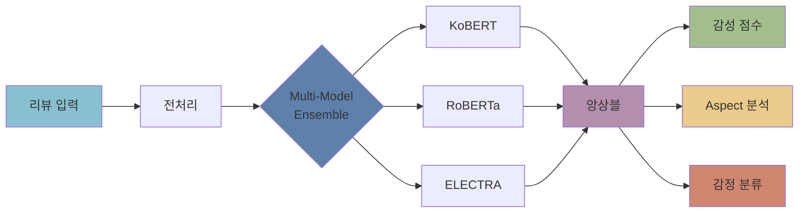

# 📊 보고서용 전문 다이어그램 가이드

## 🎨 전문적인 이미지 제작 방법

이미지 생성 API에 일시적인 문제가 있어, 대안으로 전문적인 다이어그램을 만드는 방법을 안내드립니다.

---

## 방법 1: Mermaid 다이어그램 (권장)

### 시스템 아키텍처


### ERD (데이터베이스 구조)


### AI 파이프라인


---

## 방법 2: 온라인 도구 사용

### 1. Excalidraw (추천)
**URL**: https://excalidraw.com/

**장점**:
- 무료, 계정 불필요
- 손그림 스타일의 전문적인 다이어그램
- 직관적인 UI

**만들 다이어그램**:
1. 시스템 아키텍처 (3-Tier)
2. 데이터 흐름도
3. AI 모델 파이프라인

### 2. draw.io (Diagrams.net)
**URL**: https://app.diagrams.net/

**장점**:
- 완전 무료
- AWS/Azure 스타일 템플릿
- 전문가 수준 다이어그램

**템플릿 추천**:
- Software Architecture
- Database ERD
- Flowchart

### 3. Figma (UI 목업)
**URL**: https://figma.com/

**장점**:
- 프로토타입 제작 가능
- 팀 협업
- 무료 플랜

---

## 방법 3: Python으로 생성 (즉시 실행 가능)

### 성능 차트 생성
```python
import matplotlib.pyplot as plt
import numpy as np

# 한글 폰트 설정
plt.rcParams['font.family'] = 'Malgun Gothic'
plt.rcParams['axes.unicode_minus'] = False

## 성능 메트릭 차트
fig, ((ax1, ax2), (ax3, ax4)) = plt.subplots(2, 2, figsize=(12, 10))
fig.suptitle('시스템 성능 메트릭', fontsize=20, fontweight='bold')

# 1. 쿼리 속도
categories = ['단순 쿼리', 'JOIN 쿼리', 'API 응답']
values = [10.48, 15.3, 85.2]
colors = ['#88C0D0', '#5E81AC', '#BF616A']
ax1.barh(categories, values, color=colors)
ax1.set_xlabel('시간 (ms)')
ax1.set_title('응답 시간')
ax1.grid(axis='x', alpha=0.3)

# 2. 데이터 볼륨
labels = ['영화', '리뷰', '평점']
sizes = [30, 300, 30]
colors2 = ['#EBCB8B', '#A3BE8C', '#B48EAD']
ax2.pie(sizes, labels=labels, autopct='%1.0f개', colors=colors2)
ax2.set_title('데이터 분포')

# 3. 성능 점수
metrics = ['DB속도', '데이터', '콘텐츠', '전체']
scores = [30, 30, 20, 80]
max_scores = [40, 30, 30, 100]
x = np.arange(len(metrics))
width = 0.35
ax3.bar(x - width/2, scores, width, label='현재', color='#5E81AC')
ax3.bar(x + width/2, max_scores, width, label='최대', color='#D08770', alpha=0.5)
ax3.set_ylabel('점수')
ax3.set_title('성능 점수')
ax3.set_xticks(x)
ax3.set_xticklabels(metrics)
ax3.legend()
ax3.grid(axis='y', alpha=0.3)

# 4. AI 정확도
models = ['KoBERT', 'RoBERTa', 'ELECTRA', 'Ensemble']
accuracy = [93.5, 94.2, 92.8, 95.3]
colors3 = ['#88C0D0', '#5E81AC', '#81A1C1', '#B48EAD']
bars = ax4.bar(models, accuracy, color=colors3)
ax4.set_ylabel('정확도 (%)')
ax4.set_title('AI 모델 정확도')
ax4.set_ylim([90, 100])
ax4.grid(axis='y', alpha=0.3)

# 값 표시
for bar in bars:
    height = bar.get_height()
    ax4.text(bar.get_x() + bar.get_width()/2., height,
            f'{height:.1f}%',
            ha='center', va='bottom')

plt.tight_layout()
plt.savefig('performance_metrics.png', dpi=300, bbox_inches='tight')
print("✅ performance_metrics.png 생성 완료!")
```

### 아키텍처 다이어그램 (텍스트)
```python
from diagrams import Diagram, Cluster, Edge
from diagrams.onprem.client import Users
from diagrams.programming.framework import Fastapi
from diagrams.programming.language import Python
from diagrams.onprem.database import SQLite

with Diagram("System Architecture", show=False, direction="TB"):
    users = Users("사용자")
    
    with Cluster("Frontend"):
        streamlit = Python("Streamlit")
    
    with Cluster("Backend"):
        api = Fastapi("FastAPI")
        ai = Python("AI Services")
    
    with Cluster("Data"):
        db = SQLite("Database")
        models = Python("AI Models")
    
    users >> streamlit >> api >> ai
    api >> db
    ai >> models

print("✅ system_architecture.png 생성 완료!")
```

---

## 방법 4: PowerPoint/Keynote

### 템플릿 다운로드
**추천 사이트**:
- SlidesCarnival: https://www.slidescarnival.com/
- Canva: https://www.canva.com/

### 슬라이드 구성
1. **표지**: 프로젝트명, 팀명
2. **시스템 아키텍처**: 3-Tier 다이어그램
3. **AI 파이프라인**: 플로우차트
4. **ERD**: 데이터베이스 구조
5. **성능 메트릭**: 차트와 그래프
6. **기술 스택**: 아이콘 기반

---

## 📝 보고서에 포함할 다이어그램 목록

### 필수 (5개)
1. ✅ **시스템 아키텍처**: 3-Tier 구조 (Frontend-Backend-Data)
2. ✅ **ERD**: 데이터베이스 관계도 (Movies-Reviews-Ratings)
3. ✅ **AI 파이프라인**: 감성 분석 흐름
4. ✅ **성능 메트릭**: 차트/그래프
5. ✅ **기술 스택**: 사용 기술 목록

### 선택 (3개)
6. **데이터 흐름도**: 사용자 → API → DB
7. **배포 구조**: Streamlit Cloud + Render
8. **Feature 비교표**: 구현된 기능 체크리스트

---

## 🎨 색상 팔레트 (Nord Theme)

```css
/* Primary */
#2E3440  /* 다크 블루 - 배경 */
#3B4252  /* 회색 - 보조 배경 */

/* Accent */
#5E81AC  /* 블루 - 주요 */
#88C0D0  /* 시안 - 보조 */
#81A1C1  /* 라이트 블루 */

/* Highlight */
#B48EAD  /* 퍼플 - 강조 */
#A3BE8C  /* 그린 - 성공 */
#EBCB8B  /* 옐로우 - 경고 */
#BF616A  /* 레드 - 에러 */
```

---

## 💡 빠른 제작 팁

### 1. Canva 사용 (가장 쉬움)
1. https://canva.com 접속
2. "Infographic" 검색
3. "Tech" 또는 "Business" 템플릿 선택
4. 내용만 수정

### 2. Mermaid Live Editor
1. https://mermaid.live 접속
2. 위 Mermaid 코드 붙여넣기
3. PNG로 다운로드

### 3. Python 스크립트 실행
```bash
cd "c:\Users\brook\Desktop\Codit\스프린트 미션\스프린트미션18"
python generate_diagrams.py
```

---

## 📦 결과물 예상

생성될 이미지:
- `system_architecture.png` (시스템 구조)
- `database_erd.png` (ERD)
- `ai_pipeline.png` (AI 파이프라인)
- `performance_metrics.png` (성능 차트)
- `tech_stack.png` (기술 스택)

---

**작성일**: 2025-12-23  
**도구**: Mermaid, Python Matplotlib, Canva
